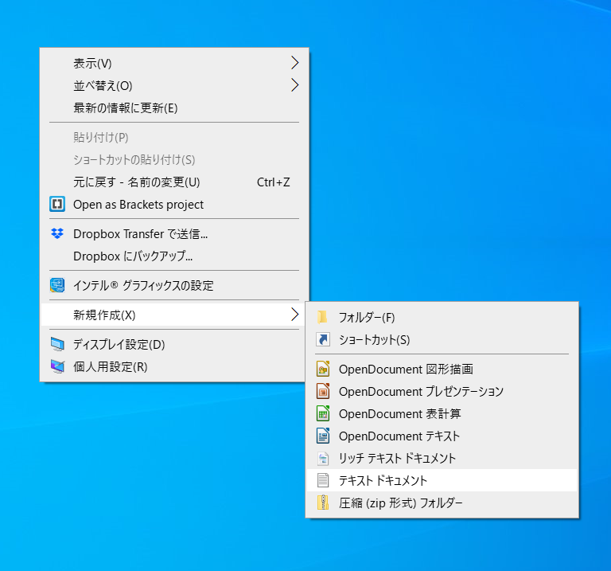
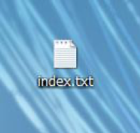

:toc: left
:sectnums: 3
:toc-title: 目次
:author: B-pro school
:revnumber: 0.1
:revdate: 202/03/13

=  WEBサイトを作れるようになろう！[Windows版]

本レッスンでは、あなたのポートフォリオの作成をゴールとして学習していきます。
まずは、あなたのPCの開発環境を整えるところからスタート。
実践ですぐに活かせる知識やテクニックを身につけることができます。さぁ、はじめましょう！

NOTE: ポートフォリオとは・・・企業から「ポートフォリオを提出してください」と言われた場合は、
「あなたの実績や力量がわかる作品集」のことを指します。
デザイナーやクリエイター職を目指す場合は、求められることが少なくありません。

ポートフォリオの例>>>
link:https://fukuimina.com/[fukuimina.com]

== メモ帳でHTMLを書いてみよう！

=== HTMLを書く準備をしよう
デスクトップ上で右クリックをして、新規作成メニュー内にあるテキストドキュメントを開きます。

するとデスクトップ上に新規テキストドキュメントファイルが作成されます。

=== ファイル名を変更しよう

作成した新規テキストドキュメントファイルの名前をindexに変更し、保存します。

この時ファイル名の後の部分「.txt」が表示されていない場合は、以下の記事を参照して「拡張子」を表示させて下さい。

*****
拡張子の説明を入れます
*****

=== HTMLを書いてみよう
早速HTMLを書いて、感覚をつかんでみましょう。
先程作成したindex.txtファイルを開きましょう。
真っ白な画面ですね。ここに“はじめてのHTML”と入力してみましょう。
ここまで出来たら、一旦保存して閉じましょう。
TXTからHTMLに拡張子を変更する。
.txtのtxt部分をhtmlに変更します。
※注意のポップアップが表示されますが、“はい”をクリックして続行して下さい。
すると先程までメモ帳だったアイコンがWEBファイルのアイコンに変わりました。
※PCはファイルをどのソフトで立ち上げるか拡張子を認識して開いています。

=== HTMLファイルをブラウザで表示させてみよう
拡張子を変更した先程のファイルをダブルクリックして開いてみましょう。
どうですか？先程メモ帳で入力した文字がブラウザで表示されました。
もう少し文字に変化を与えてみましょう。

=== 文字に変化を与えてみましょう
タグを入れてみよう
タグを入れることで、文字に変化を与えることができます。
まずはタグを入れてみて感覚を身につけてみましょう。

== 学習環境を整えよう!

HTML/CSSの学習環境を整えよう
----
HTML/CSSの学習環境を整えよう！の説明です
----

==== Chromeブラウザを導入しよう！

----
Chromeブラウザを導入しよう！の説明です
----

メモメモ

#マーカー#

[.underline]#下線#

pass:[文字の色を変えます]

youtubeも参照できます

video::ukAYyRUE8KQ[youtube]

==== Chromeブラウザを導入しよう！
==== Bracketsエディタを用意しよう!
==== Bracketsエディタをエディタを設定していこう!
==== プログラミング用フォントを導入しよう!
==== ファイルの拡張子を表示させよう!

== HTML/CSSの概要を理解しよう
=== プロフィールサイトを作ってみよう
=== ブラウザに名前を表示しよう
=== タグでマークアップしてみよう
=== imgタグで画像を表示しよう
