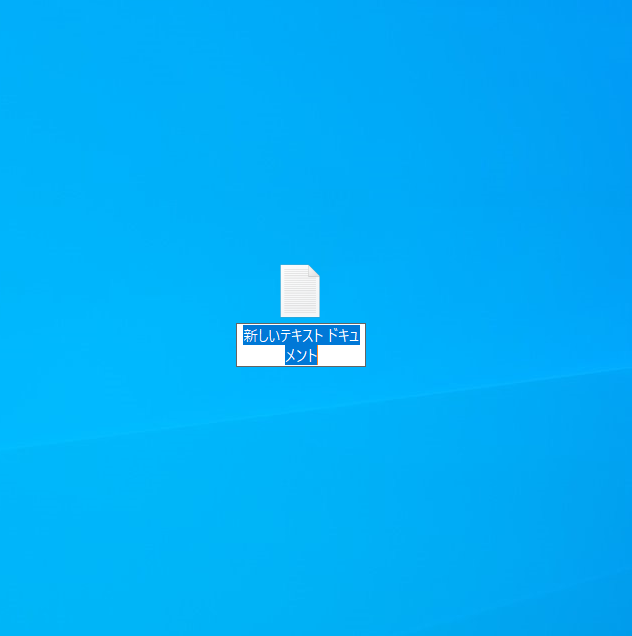

:toc: left
:sectnums: 3
:toc-title: 目次
:author: B-pro school
:revnumber: 0.1
:revdate: 202/03/13

=  WEBサイトを作れるようになろう！[Windows版]

本レッスンでは、あなたのポートフォリオの作成をゴールとして学習していきます。
実践ですぐに活かせる知識やテクニックも身につけることができます。さぁ、はじめましょう！

NOTE: ポートフォリオとは・・・企業から「ポートフォリオを提出してください」と言われた場合は、
「あなたの実績や力量がわかる作品集」のことを指します。
デザイナーやクリエイター職を目指す場合は、求められることが少なくありません。

**************

ポートフォリオの例

・link:https://fukuimina.com/[fukuimina.com] / 福井のポートフォリオ

**************

== メモ帳でHTMLを書いてみよう！

=== HTMLを書く準備をしよう
デスクトップ上で右クリックをして、新規作成メニュー内にあるテキストドキュメントを開きます。

image:img/1-1.png[auto, 500]

するとデスクトップ上に新規テキストドキュメントファイルが作成されます。

=== ファイル名を変更しよう

作成した新規テキストドキュメントファイルの名前をindexに変更し、保存します。

image:img/1-3.png[auto, 500]

この時ファイル名の後の部分「.txt」が表示されていない場合は、以下を参照して「拡張子」を表示させて下さい。

タスクバーの「エクスプローラー」を起動します。
そして左上のメニューから「表示」をクリックします。

ここで表示された「ファイル名拡張子」のチェックボックスに、チェックを入れます。

※チェックボックスにチェックが既に入っている場合は、拡張子が表示されている設定です。

image:img/1-4.png[auto, 500]

=== HTMLを書いてみよう
早速HTMLを書いて、感覚をつかんでみましょう。

先程作成したindex.txtファイルを開きましょう。
真っ白な画面ですね。ここに“はじめてのHTML”と入力してみましょう。

ここまで出来たら、一旦保存して閉じましょう。

=== 拡張子を変更します。

【.txt】部分を【.html】に変更しましょう。

※注意のポップアップが表示された場合は、“はい”をクリックして続行して下さい。

すると先程までメモ帳だったアイコンが変わりました。

image:img/1-7.png[auto, 500]

※PCはファイルをどのソフトで立ち上げるか拡張子を認識して開いています。

=== HTMLファイルをブラウザで表示させてみよう
拡張子を変更した先程のファイルをダブルクリックして開いてみましょう。

image:img/1-8.png[auto, 500]

どうですか？先程メモ帳で入力した文字がブラウザで表示されましたね。
もう少し文字に変化を与えてみましょう。

=== タグを入れて文字に変化を与えてみましょう

タグ、いわゆる文字に意味をもたせる為のHTMLソースを加えてみます。
まずはタグを入れてみて感覚を身につけてみましょう。

先ほど作成したindex.htmlを右クリック、
プログラムから開く > メモ帳で開きます

“はじめてのHTML”の前に<h1>後ろに</h1>を入力してみて下さい。

image:img/1-10.png[auto, 500]

作成したHTMLの内容がどのように表示されるか確認する為に、先程と同様にindex.txtのtxt部分をhtmlに変更します。

これはh1（エイチワン）タグと言います。

image:img/1-11.png[auto, 500]

いかがでしょうか。文字が大きく、太く表示されたことがわかります。
これはh1タグが大見出しという意味を持っている為、このように表示されるわけです。

h1以外に、どんなタグがあるのでしょうか？よく使うタグをいくつか紹介します。

**************
【HTML】

<ul>

<li>今日やること</li>

<li>明日やること</li>

</ul>

【結果】

・今日やること

・明日やること
**************

**************
【HTML】

赤い文字

【結果】

pass:[赤い文字]
**************

WEBプログラミングを学習するにあたって、ほとんどの人がまず最初に学習するのがこのHTMLです。

HTMLを書くというとこはソースを作っていく作業のことです。
また、タグとは文字に意味を持たせ、表示を変化させることが可能です。
さらには文字の色を変えたり、画像を挿入したりとタグには沢山の種類が存在します。
このようにHTMLはタグを駆使して、ウェブページを表現するために用いられるプログラムということになります。

HTML体験はいかがでしたか。
では次の項から本格的にHTMLを学んでいきましょう！

== 学習環境を整えよう!

必要なアプリケーションは、
ブラウザと、テキストエディタです。

==== Chromeブラウザを導入しよう！

レッスンと同じ環境で学習するために、まずはChromeブラウザを導入していきます。

WindowsのOSには標準でMicrosoft Edgeがインストールされています。

image:img/2-1.png[auto, 500]

ただし、本レッスンではGoogle chromeを使用するため、新しくインストールしていきます。

検索窓に『chrome ダウンロード』と入力し検索。

image:img/2-3.png[auto, 500]

検索結果上位に公式サイトが出てくるのでそちらを開きましょう。

公式サイトを開くとすぐにダウンロードボタンがあるのでこちらからダウンロードしましょう。

image:img/2-4.png[auto, 500]

無事インストールが完了しました。

image:img/2-5.png[auto, 500]

ダウンロードが終わると下記のようにブラウザが立ち上がりますが一旦バツで閉じましょう。

====  Visual Studio Codeエディタを用意しよう!

さて、次にプログラミング用のエディタを導入していきましょう。
本レッスンでは、 Visual Studio Codeというエディタをおすすめしているので、導入していきます。

chromeで Visual Studio Codeと検索して

==== Visual Studio Codeエディタを設定していこう!
==== プログラミング用フォントを導入しよう!

== HTML/CSSの概要を理解しよう
=== プロフィールサイトを作ってみよう
=== ブラウザに名前を表示しよう
=== タグでマークアップしてみよう
=== imgタグで画像を表示しよう

メモメモ

#マーカー#

[.underline]#下線#

pass:[文字の色を変えます]

youtubeも参照できます

video::ukAYyRUE8KQ[youtube]
